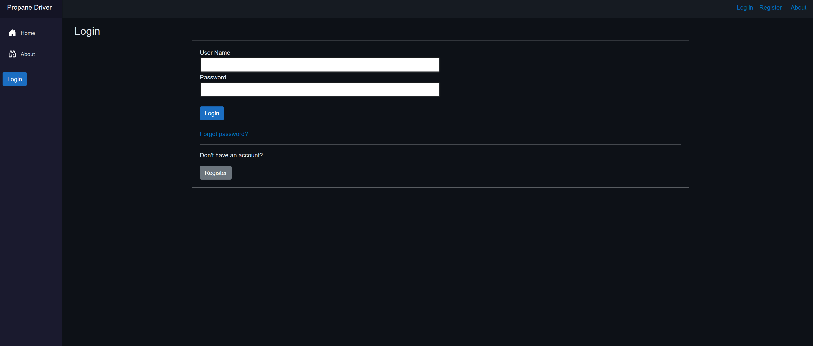
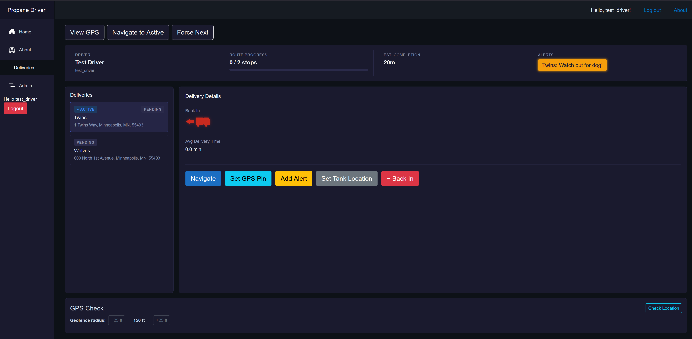
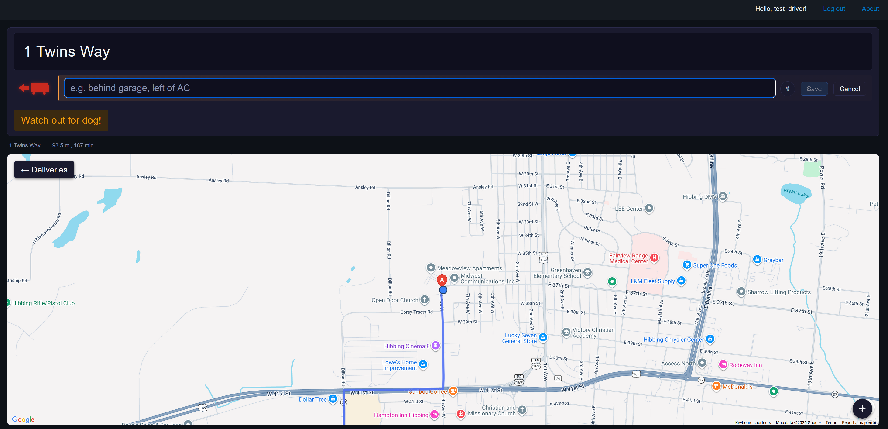

# PropaneDriver

A full-stack delivery app for propane bobtail drivers. Built solo, with AI assistance from Claude.

> "Driver first. Everything else second."

---

## What it is

PropaneDriver is a working Blazor WebAssembly + ASP.NET Core 8 application that handles the day-to-day workflow of a propane delivery driver: routes, deliveries, addresses with gate codes and tank locations, geofenced arrival detection, voice prompts for hands-on-the-wheel use, dispatch screenshot ingestion, and per-address delivery-time history.

The domain is not a toy. The author is currently a propane driver. Every UI decision has a reason behind it that a product manager could not have surfaced from a focus group.

## Screenshots

> Images live in `docs/screenshots/`. Replace the placeholders with your own captures — filenames below match what the README expects.

### Login & registration


Role-based auth (driver and admin roles) backed by BCrypt-hashed passwords stored in Azure SQL and a JWT issued at sign-in. Includes register, forgot-password, and reset-password flows; reset emails are sent through Azure Communication Services with single-use tokens. Pages are gated by `[Authorize(Roles = "driver")]` / `"admin"`, and the same role claims are enforced server-side on the matching endpoints.

### Route overview


The driver's day at a glance: today's stops with addresses and tank-location notes; an "active" delivery banner; per-address rolling-average delivery time; quick actions to view GPS, navigate to the active stop. This is the page a driver actually lives on during a shift.

### Navigation with tank-location notes and alerts


Turn-by-turn destination view that pulls tank location, back-in flag, and any alerts attached to the delivery from the database. Alerts surface at the top in oversized text so they're easy to read. Edits to the tank-location note PUT back to the address row so the next driver inherits the fix.

### Geofenced arrival + spoken cues


Client-side `GeoFenceService` watches the browser's geolocation stream and fires when the driver enters the radius around the destination. `SpeechService` speaks the cue aloud through the Web Speech API so the driver doesn't have to enter text manually. Arrival times are recorded and roll into the per-address average shown on the route page.

### Dispatch screenshot import (OCR)


Drivers receive their stops as screenshots from a third-party dispatch app. The import endpoint runs them through Azure Document Intelligence, then a hand-tuned parser (`DispatchScreenshotParserService`) walks the OCR output to extract customer and address for each row. Multi-image upload is supported so a whole route can be ingested in one pass. Duplicate rows across uploaded images are detected and visually flagged in the preview so the driver does not save the same stop twice, and the parser exposes its line-by-line view for diagnostics when an unfamiliar layout shows up.

### Self-service dispatch


A driver-facing companion to the admin route page: drivers can pick a date, load whatever route already exists for that day, and build or edit it themselves without waiting on an admin. The endpoints behind this page enforce a "self or admin" ownership rule server-side — a signed-in driver can only see and mutate routes tied to their own driver id, while an admin can act on any driver's route through the same API.

### Route admin


Pick a driver and a date, edit the route. Addresses are normalized through Google Geocoding before they hit the database so coordinates are consistent across imports. Long-running flags, back-in flags, and tank-location text are all editable here without round-tripping through dispatch.

### Admin tools — Document Intelligence scanner


An admin-only Tools page (`/tools`, gated by `[Authorize(Roles = "admin")]`) that exposes the Azure Document Intelligence pipeline directly: pick one or more image files, choose a prebuilt model (`prebuilt-read`, `prebuilt-layout`, `prebuilt-document`, `prebuilt-invoice`, `prebuilt-receipt`, `prebuilt-idDocument`, `prebuilt-businessCard`) from a `AzureDocumentIntelligenceModel` enum, then press **Scan** to run them. Scanning is deliberately button-gated rather than firing on file selection so the admin doesn't burn calls every time they reach for a file picker, and a quick summary of what Azure does with the uploaded bytes lives alongside the source in `azure-doc-intelligence-security.txt` at the repo root.

---

## What it demonstrates

- **A complete, deployed application** — not a tutorial fork or a half-finished side project. Auth, persistence, cloud services, OCR, email, geocoding, and a passing test suite all coexist in one repo.
- **AI used as a force multiplier, not a substitute for judgment.** The architecture, the domain model, the trade-offs, the security choices, the data shape — all driven by the engineer. The model wrote a lot of the keystrokes; it did not pick the destination.
- **Honest scope.** Solo engineer, real Azure resources, real users in mind. No team to hide behind on review.

## Architecture at a glance

```
PropaneDriver.Client   Blazor WebAssembly (.NET 8) — UI, geolocation, geofencing, speech
PropaneDriver.Server   ASP.NET Core 8 minimal-API host — endpoints, EF Core, Azure services
PropaneDriver.Shared   DTOs and interfaces shared across the wire
PropaneDriver.Tests    xUnit tests against an in-memory + live-SQL test harness
```

- **Frontend.** Blazor WebAssembly. Razor pages with scoped CSS, a custom geofence service, a speech service for spoken turn-by-turn cues, and a client-side error logger that ships browser exceptions back to the server.
- **Backend.** ASP.NET Core minimal APIs, organized one resource per file under `Endpoints/`, each exposing an `IEndpointRouteBuilder` extension method. `Program.cs` wires them up explicitly — no reflection-based discovery.
- **Data.** Azure SQL via Entity Framework Core, accessed with `DefaultAzureCredential` and a managed identity token rather than a stored password. Schema is bootstrapped by an idempotent raw-SQL initializer (a deliberate choice — see below) instead of EF migrations.
- **External services.** Azure Document Intelligence for OCR (both the dispatch-screenshot importer and the admin Tools scanner, with the prebuilt model chosen per-call via the `AzureDocumentIntelligenceModel` enum), Azure Communication Services for transactional email (password reset), Google Geocoding for address normalization, BCrypt for password hashing, JWT for the issued sign-in token.

## Notable engineering decisions

These are the kinds of calls a reviewer would want to see explained on a take-home.

- **Raw-SQL idempotent bootstrap, not EF migrations.** A single solo developer iterating on schema does not benefit from the migration ledger; they pay its costs. `DatabaseInitializer` runs `CREATE TABLE IF NOT EXISTS`-style SQL on startup. If the project ever grows a team, migrations get added; until then, the simpler tool wins.
- **Endpoints as static extension methods, one file per resource.** Avoids the controller-class boilerplate of MVC while keeping each resource's routes physically co-located. Easy to grep, easy to test, easy to delete.
- **DTOs in `PropaneDriver.Shared`, EF row types in `PropaneDriver.Server/Data` with a `*DbRecord` suffix.** Keeps the wire shape distinct from the storage shape so the database can be reshaped without breaking the client contract.
- **Managed-identity auth to Azure SQL.** No connection-string passwords in config. The server requests a token from `DefaultAzureCredential` and attaches it to the SQL connection at request time.
- **Hand-tuned regexes for dispatch-screenshot OCR.** The dispatch app the company uses produces two different address layouts depending on screen width. The parser handles both with documented regexes plus a fallback line walker. This is the kind of glue work that pays off only if you know the domain — and breaks badly if you do not.
- **Tests live against a real test database fixture (`TestDb`) plus a live-DB harness for time-sensitive queries.** Mocks were rejected for the persistence layer; the relevant bugs only surface against the real engine.
- **Roles are enforced in two places, not one.** `[Authorize(Roles = "...")]` on the Razor pages keeps the UI honest, but the same role claims are re-checked on every endpoint that mutates someone else's data. Driver-owned endpoints additionally apply a "self or admin" rule so an authenticated driver cannot read or mutate another driver's route by guessing an id.
- **Document Intelligence scans are explicitly button-triggered.** The admin Tools page does not auto-scan on file selection — every call to Azure costs money and produces a 24-hour retention window on Azure's side, so the user opts in per batch. The model used for each call is passed from the client via an enum so adding a new prebuilt model is a one-line change in `AzureDocumentIntelligenceModel`.

## Running it

Prerequisites: .NET 8 SDK, an Azure SQL database (or LocalDB if you wire up a local connection string), and Azure credentials available to `DefaultAzureCredential` (Azure CLI login, Visual Studio auth, or a managed identity).

```powershell
# Restore and build
dotnet build PropaneDriver.slnx

# Run the host (serves the WASM client on the same origin)
dotnet run --project PropaneDriver.Server

# Run tests
dotnet test PropaneDriver.Tests
```

Azure-specific configuration (Document Intelligence endpoint/key, ACS connection string, Google Geocoding key) is supplied via user secrets or environment variables — no credentials are committed.

## Project layout

```
PropaneDriver.Client/
  Pages/            Razor pages: Home, Route, Navigation, Dispatch, Admin, Tools, Login, Register, ...
  Services/         Geolocation, geofencing, speech, per-resource API clients, error logger
  Authentication/   Custom auth state provider
  Layout/           Shell, nav, alert UI
PropaneDriver.Server/
  Endpoints/        One file per resource (Auth, Driver, Route, Delivery, Address, ...)
  Services/         DocumentIntelligence, Email, GPS helpers, dispatch-screenshot parser
  Data/             EF DbContext, *DbRecord row types, schema initializer
PropaneDriver.Shared/
  Dtos/             Request/response shapes
  Interfaces/       Contracts shared across client and server
PropaneDriver.Tests/ Endpoint and service tests (xUnit)
```

## On AI assistance, plainly

The engineer behind this project used Claude the way a senior engineer uses a fast junior who never gets tired: it drafts, refactors, and chases down boilerplate while the human owns the design, reviews the diff, and decides what ships. The decisions in the *Notable engineering decisions* section above were not produced by a prompt — they were imposed on the code by someone who has seen what happens when you get them wrong.
